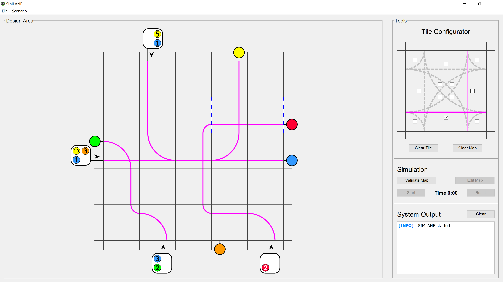
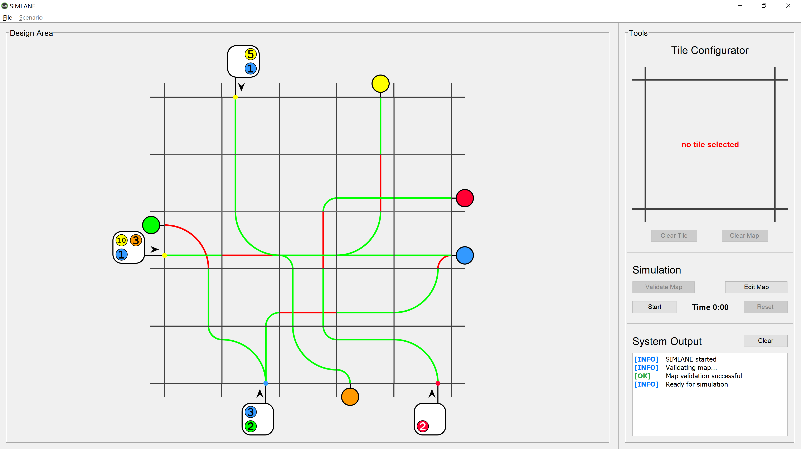
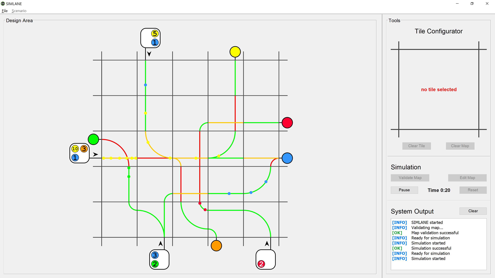

# Traffic Simulator and Game (SIMLANE)

| Author | Institution | Date |
|:---|:---|:---|
| Etienne Gubler | Zurich University of Applied Sciences | Sept. 2019 - Dec. 2019 |

## Description

Traffic simulator with **behavioral algorithm** that models a human driver and the physics of a real car. Implements the **Wiedemann 99 car following model**. The simulation tool also constitutes a fun and challenging puzzle game. After solving a scenario, the same puzzle can be played again to **improve the efficiency of the designed road network**.

## Project Structure

- Software architecture and requirements specification: [SIMLANE_architecture.pdf](./docs/report/SIMLANE_architecture.pdf)
- Wiedemann 99 car following algorithm definition: [W99-algorithm.pdf](./docs/papers/W99-algorithm.pdf)
- IntelliJ IDEA project root: [intellij/SIMLANE/](./intellij/SIMLANE/)
- Main srouce files: [intellij/SIMLANE/src/ch/simlane/](./intellij/SIMLANE/src/ch/simlane/)

## Screenshots

### Creating a traffic network (and solving the puzzle)

### Validating the traffic network (all cars must be able to reach their destination)

### Simulating the trffic network with realistic cars (models physics and human behavior)

